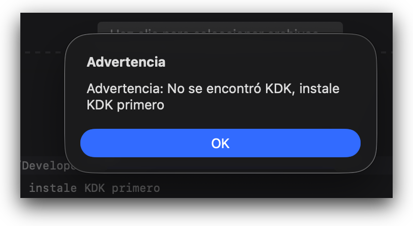
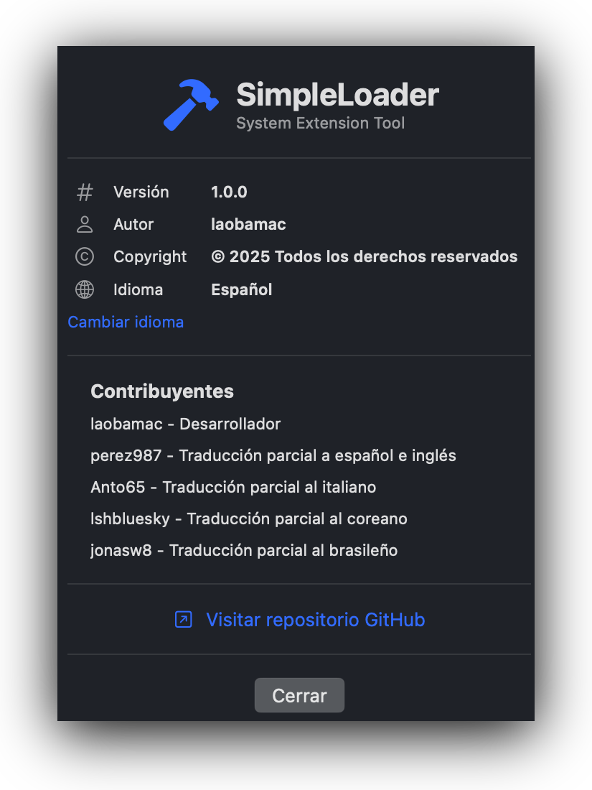

# AppleHDA back in Tahoe

AppleHDA.kext has been removed starting with macOS Tahoe beta 2 and is unlikely to be included in future versions. AppleHDA.kext provides sound support to the operating system. It is required for integrated audio to work with AppleALC.kext.

It has an important role in the interaction between macOS and the sound device:

- Enables macOS to detect sound devices built into the hardware (e.g., speakers or headphones).
- Reads the Layout-ID value from the firmware, which is a unique identifier for the sound configuration of each specific Mac model.
- Based on the Layout-ID, loads sound maps specific to each Mac.

In older versions of macOS, ways were developed to patch AppleHDA.kext to make sound work on chips not supported by Apple. More recently, tools have been developed to inject sound support through the kernel, avoiding the need to modify AppleHDA.kext directly. The most commonly used tool is AppleALC.kext, created by the OpenCore team (vit9696 is the original author), which allows us to have native audio in macOS with codecs not supported by Apple without modifying the file system. It works next to AppleHDA.kext. For this reason, integrated audio is lost when AppleHDA.kext doesn't exist.

Last Intel Macs have a T2 chip that handles audio features and do not need AppleHDA.kext. Since all Mac models that can be upgraded to macOS Tahoe have a T2 chip, Apple has acted in its usual manner, removing elements that are not required by supported models.

Without AppleHDA.kext or AppleALC.kext, the ability to use digital audio through the graphics card outputs (HDMI or DisplayPort) is retained because this system relies on other kexts. But those who don't have this option lose audio through the motherboard chip since Tahoe Beta 2.

### Alternative Solution: USB Audio Chips

Many audio devices that connect to a USB port work natively on macOS; they don't require AppleHDA. I've tried Sound Blaster Play! 3, currently priced at around €15, and it works perfectly on the beta versions of macOS Tahoe. Of course, it also works on the previous macOS versions I've tested it on: Sequoia, Sonoma, and Ventura.

Disadvantages:

- Slightly higher CPU usage than the motherboard chip.
- Only two connections: speakers (headphones) and microphone, sufficient for most users, but not all.

### Reinstall AppleHDA.kext: MyKextInstaller and SimpleLoader

Developers are already looking for a way to reinstall AppleHDA.kext, extracted from Tahoe Beta 1 or Sequoia installation. It's not a simple task since this kext must be located in /System/Library/Extensions, which by design is a non-writable folder.

OCLP team is working on a patch that will be applied similarly to current root patches. Still in an early stage, it's not yet viable for end users.

*Mirone* has [MyKextInstaller](https://github.com/Mirone/MyKextInstaller) app. Although it's on GitHub, source code isn't yet available. Its interface is simpler, making it very easy to use. As an added benefit, you can also download AppleHDA.kext along with the app.

*Laobamac* has SimpleLoader app on GitHub. It's implemented in SwiftUI. Main drawback is that base language is Chinese. There are already translations to English, Spanish, Korean and Brazilian Portuguese, not up to date on the *Laobamac* repo but yes in [my fork](https://github.com/perez987/SimpleLoader) .

Both applications allow you:

- to get back sound from the built-in audio hardware by reinstalling AppleHDA.kext (extracted from first Tahoe beta)
- to restore the system to the last unmodified system image (last sealed snapshot) to undo the process.

I've tested them and they seem to work fine for installing AppleHDA.kext and for reverting the installation.

### Requirements for MyKextInstaller and SimpleLoader

- Tahoe Kernel Debug Kit. If the same macOS version exists (e.g., `Kernel Debug Kit 26.2 build 25C56` for `macOS Tahoe 26.2 build 25C56`), that's the one to use. If it doesn't exist because Apple hasn't released it yet, use the closest previous version. MyKextInstaller downloads and installs it for you but SimpleLoader doesn't. My repository's version of SimpleLoader does implement the option to download the correct KDK if it doesn't exist on your system.

<figure>
  <figcaption></figcaption>
   
</figure>
- AppleALC version 1.9.5 or later in the OpenCore Kexts folder and in config.plist (as usual)
- config.plist: csr-active-config=03080000 (SIP partially disabled)
- AppleHDA.kext extracted from the KDK. The default path is
`/Library/Developer/KDKs/<KDK_version-and-build.kdk>/System/Library/Extensions/AppleHDA.kext`

**Note**: AppleHDA.kext that exists in the macOS 15 Sequoia installation also works.

### MyKextInstaller

Simple interface. The app is now signed and notarized, so you will no longer see 'Move the application to the trash' message.

### SimpleLoader

**Main Window**

- Select the installed KDK(or download it when asked)
- Select the kext to install
- Log messages (operation log)
- Options
- Bottom section with buttons that perform some tasks:
	- merge installed KDK without installing AppleHDA.kext
	- rebuild extension cache
	- install AppleHDA.kext
	- create a new system snapshot or restore the snapshot prior to installing AppleHDA.kext (this undo AppleHDA.kext installation).

**About button**

Opens a window with two sections:

- Copyright, current language and link to change language (shows available languages)
- List of translators.

<figure>
  <figcaption></figcaption>
   
</figure>

### Restart

You must restart your computer for the AppleHDA.kext installation to take effect. After restarting, integrated audio should work as it did in Sequoia and earlier versions. You can verify that AppleHDA is loading with kextstat command:

```
/Users/yo > kextstat | grep "AppleHDA"
Executing: /usr/bin/kmutil showloaded
No variant specified, falling back to release
150 1 0xffffff7f94b17000 0x12fb4 0x12fb4 com.apple.driver.AppleHDAController (600.2) 759DA883-704E-34C3-82CC-616197AE4284 <149 147 110 19 9 8 7 6 3 1>
164 0 0xffffff7f94a60000 0x8fe90 0x8fe90 com.apple.driver.AppleHDA (600.2) 0E40ED12-AD6D-3015-9DD0-55149B145A2A <163 150 149 147 121 110 8 7 6 3 1>
165 0 0xffffff7f94b2e000 0x8d6 0x8d6 com.apple.driver.AppleHDAHardwareConfigDriver (600.2) C4C8A9E5-267F-3238-9806-CCDB47297AC6 <6 3>
```

### Reminder

Upgrading or installing macOS Tahoe will lose these changes and you'll need to reinstall AppleHDA.kext again.

